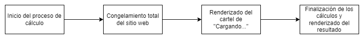

# Detección de colores


   
[Link deploy última version con react](https://color-detection-v2-react.netlify.app)


Se trata de una aplicación en la que se analizan los pixeles de una imagen, se los agrupa según un criterio y se define lo que serían los colores mas representativos de la misma.
    <p align="center">


## Características

- Uso de la API de javascript de web-workers.
- Modo noche.
- Diseño responsive.
- Funcionamiento totalmente ejecutado del lado del cliente (sin conexión con un backend)
- Posibilidad de subir imágenes locales.
- Funcionalidad de búsqueda de imágenes desde la pagina de uplash.com
- Almacenamiento de imágenes en localStorage, asi como también la eliminación de estos cuando se lo desee y la eliminación de todas las imágenes del localStorage.
- Selección de modo de colores usando colores RGB o HSL.
- Selección de la tolerancia para determinar su un color es similar a otro.
- Selección de la cantidad de divisiones de la imagen.
- Tiempos de procesamiento de los cálculos.
- Renderizacion de los colores primarios (los colores mas representativos de la imagen).
- Renderizacion de la imagen con las divisiones especificadas, desde la cual se determinan los colores primarios.

## Dependencias

```

		"@fortawesome/fontawesome-svg-core": "^6.4.0",
		"@fortawesome/free-brands-svg-icons": "^6.4.2",
		"@fortawesome/free-solid-svg-icons": "^6.4.0",
		"@fortawesome/react-fontawesome": "^0.2.0",
		"@tailwindcss/forms": "^0.5.3",
		"flowbite": "^1.7.0",
		"flowbite-react": "^0.4.10",
		"framer-motion": "^10.12.18",
		"gsap": "^3.12.1",
		"match-sorter": "^6.3.1",
		"react": "^18.2.0",
		"react-dom": "^18.2.0",
		"react-router-dom": "^6.14.1",
		"sort-by": "^1.2.0",
		"swiper": "^10.0.3",
		"uuid": "^9.0.0"
```

## Instrucciones para ejecutarlo

Inicializar en modo development.

```
npm run dev
```

Inicializar la creacion del archivo out de tailwind.

```
npm run tailwind
```

## Enfoque

La aplicación tiene un enfoque del lado mas experimental, como a modo de prueba y investigación. Es por ello que se tiene la posibilidad de alternar entre los modos de colores (RGB y HSL), por ejemplo, para poder llegar a una conclusion de cual modo de color es el que mejor se comporta a la hora de mostrar un color "mas representativo" de la imagen. Asi también con los demás parámetros.

Inicialmente se planteo este proyecto como el puntapié inicial para luego poder crear una librería mucho mas simple donde simplemente se cargue una imagen y automáticamente se devuelva el color mas representativo de la misma.

En algún momento del proceso de desarrollo se me fueron ocurriendo mas ideas y sumando entusiasmo de forma que fui incorporando estilos de la librería de componentes de flowbite, y fui puliendo un poco el código.

## Sobre el proyecto

Este proyecto nace de una duda personal en cuanto a si se podría establecer el color de un contenedor de una imagen según el color de la misma. A raíz de esto se inicio una investigación por varios medios llegando a la conclusion que para hacer esto seria necesario el uso de la API de JavaScript que es Canvas.

La misma permite el análisis de cada uno de los pixeles de la imagen que se le monte (es una de las cosas que se puede realizar, ya que las funcionalidades que ofrece son muy amplias). Pero la manipulación de datos era un tanto compleja y se tuvo que investigar mas a fondo sobre este tema.

Se puede ver en los commits iniciales que el proyecto nace con el uso de javascript vanilla (esto porque en ese momento si bien conocía React, estaba cursando un curso y estábamos viendo javascript, asi que se decidió hacer una primera versión con esto). La primera version no contaba con ningún framework de estilos y su funcionamiento cumplía pero tenia varias falencias en cuanto a rendimiento y la organización de código.

Posteriormente, y luego de un descanso del proyecto me propuse el objetivo de refactorizar todo el código para llevarlo a React e implementar el framework de css de Tailwind. Esta tarea fue un tanto complicada debido a que el código inicial no estaba muy bien organizado.

### Implementación de web-workers

Durante la primera version del proyecto (javascript vanilla), se pudo observar que a medida que la cantidad de divisiones aumentaba, el tiempo de procesamiento también lo hacia. El gran problema era que no tenia programado algún tipo de feedback al usuario en cuanto a comunicarle que la imagen esta siendo procesada y la pagina web no había crashed.

Al querer implementar esto con algún tipo de spinner me tope con la curiosidad que de por mas que implementare este spinner o loader el comportamiento era el siguiente:



Entonces el problema era que la aplicación se congelaba el tiempo en que demoraba en realizarse los cálculos y al finalizar recién aparecía el cartel de cargando. Cuando lo que se buscaba era que al iniciar el calculo se muestre el cartel de cargando, se espere el tiempo necesario para la finalización del proceso y se termine el calculo ocultándose el cartel de "Cargando..."

### El problema, bloqueo del hilo principal

Al detectar el problema me dedique a investigar las posibles causas de tal comportamiento. Luego de varias pruebas y lecturas pude darme cuenta que era eso, el proceso de cálculo era tan exigente que bloqueaba por completo el hilo principal del navegador y este (durante este tiempo que dura el procesamiento) no podia realizar NINGUNA otra tarea (siquiera poder seleccionar un texto).

Lo que había sucedido es que no tenia magnitud de las operaciones que estaba realizando, resulta que para el manejo de pixeles con canvas, cada pixel se ve representado por 4 elementos.


Entonces la cantidad de información que se manejaba era 4 veces la resolución total de la imagen a procesar, lo que llevaba a arrays con longitudes de números bastantes grandes. Al conocer esta realidad que había pasado por alto es que aparece una posible solución, ejecutar estas tareas de forma asíncrona.

En ese momento si tenia conocimientos del manejo de promesas y de la sintaxis de async / await, pero no la había aplicado para algo mas que no sea un fetch de datos desde una API. Creía haber entendido el concepto del event-loop, pero no fue hasta la ejecución de este proyecto en el cual realmente profundice en estos conceptos.

Busque trabajar creando promesas para la resolución de los cálculos que demandaban mas procesamiento, tuvo un resultado mejor a la situación anterior pero aún el principal problema persistía. Lo que me impulso a seguir en la investigación respecto a alguna solución.

Encontré que una solución seria la de crear un backend y enviar la lógica de procesamiento de imagen hasta ahi, pero en este caso quería mantener la aplicación solo del lado del cliente, quizás porque quería encontrar otra solución.

### Utilizando más hilos del navegador

En esta investigación llegué con los web-workers, una API de javascript que permite el uso de otros hilos del navegador del cliente (hablando de forma muy sencilla). Era algo totalmente nuevo para mí y no había escuchado de estos anteriormente. Básicamente nos permite "trasladar" lógica que sea muy demandante a otro hilo del navegador del dispositivo del cliente, pero con varias restricciones, una de estas era la que en esta lógica que se "traslada" no se podía interactuar con el DOM.


Para el uso de estos hilos, la API ofrecía un sistema de envió de mensajes desde y hacia el "worker". Entonces se debía refactorizar el código de manera de poder aislar la parte de la lógica que era demandante de poder de calculo y trasladarla a este hilo (en este caso moverla a otro fichero de javascript). Luego de varias pruebas y errores se pudo llegar a una version en la que funcionaba de forma correcta, y ahora se habia solucionado el problema del congelamiento a la hora de procesar la imagen.
